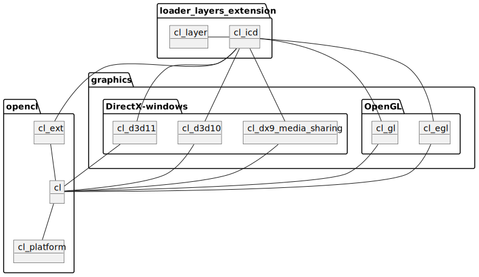

[](https://crates.io/crates/opencl-sys)
[](https://docs.rs/opencl-sys/)
[](https://www.khronos.org/registry/OpenCL/)
[](https://opensource.org/licenses/Apache-2.0)
[](https://github.com/kenba/opencl-sys-rs/actions)

OpenCL C FFI bindings for the Rust programming language.

# Description

Rust [FFI](https://doc.rust-lang.org/nomicon/ffi.html) Bindings to the Khronos
[OpenCL C language headers](https://github.com/KhronosGroup/OpenCL-Headers),
see the [OpenCL Resource Guide](https://www.khronos.org/opencl/resources).

  
*OpenCL Packages*

The API for OpenCL versions and extensions are controlled by Rust features such as "CL_VERSION_2_0" and "cl_khr_gl_sharing".  
The default features are "CL_VERSION_1_1" and "CL_VERSION_1_2".

Rust deprecation warnings are given for OpenCL API functions that are deprecated by an enabled OpenCL version e.g., `clCreateCommandQueue` is deprecated whenever "CL_VERSION_2_0" (or above) is enabled.

The Rust FFI files attempt to match the format and layout of the original
C source files instead of [bindgen](https://rust-lang.github.io/rust-bindgen/)
output files to ease maintenance.

```
bindgen ../OpenCL-Headers/CL/opencl.h -o opencl.rs -- -I ../OpenCL-Headers/CL
```

The library is declared [no_std](https://docs.rust-embedded.org/book/intro/no-std.html).

## Use

OpenCL requires that an appropriate OpenCL hardware driver(s) and an OpenCL Installable Client Driver (ICD) are installed.  
OpenCL GPU hardware driver(s) are installed with graphics drivers by the main manufacturers: Nvidia, AMD and Intel.  
However, an OpenCL ICD must usually be installed manually by:

- a Linux package manager, e.g., `sudo apt-get install intel-opencl-icd`
- or a Windows download and install from
<https://www.intel.com/content/www/us/en/developer/articles/technical/intel-cpu-runtime-for-opencl-applications-with-sycl-support.html>

Note: you do *not* need to install an OpenCL ICD from the same manufacturer as your hardware.  
In general the more up to date the OpenCL ICD, the better.

## Contribution

If you want to contribute through code or documentation, the [Contributing](CONTRIBUTING.md)
guide is the best place to start.  
If you have any questions, please feel free to ask.
Just please abide by our [Code of Conduct](CODE_OF_CONDUCT.md).

## License

Licensed under the Apache License, Version 2.0, as per Khronos Group OpenCL.  
You may obtain a copy of the License at: <http://www.apache.org/licenses/LICENSE-2.0>

Unless you explicitly state otherwise, any contribution intentionally submitted
for inclusion in the work by you, as defined in the Apache-2.0 license,
shall be licensed as above, without any additional terms or conditions.

OpenCL and the OpenCL logo are trademarks of Apple Inc. used under license by Khronos.
